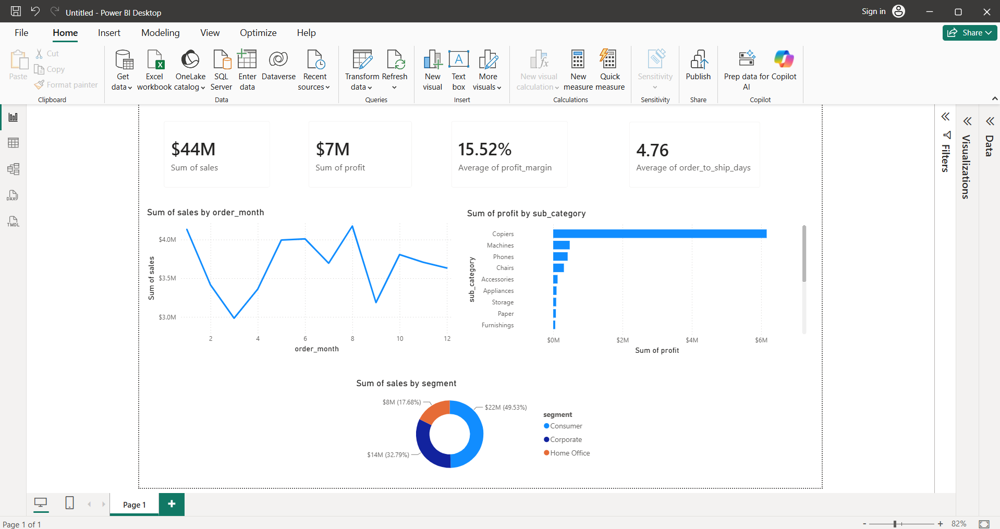

# End-to-End Sales Analytics Pipeline

## Business Overview



This project is a complete end-to-end data pipeline built to answer real business questions about sales performance, regional profitability, and product line margins. It demonstrates a full data engineering and analytics workflow: extracting raw data, cleaning it via Python/Pandas, loading it into a SQLite database, analysing it via SQL, and visualising the results in Power BI.

## Dataset
**Source**: A procedurally generated synthetic retail sales dataset (~9,600 orders).
This dataset is modeled on the structure of the public Superstore dataset, generating realistic distributions for sales, profit, and product categories to demonstrate a full data engineering and BI workflow.

The dataset mimics the structure of standard retail data with 21 columns (Orders, Customers, Products, Regions, Sales, Profits).

## Setup & Execution

### 1. Requirements
- Python 3.9+
- `pandas`, `requests` (see `requirements.txt`)
- SQLite3 (built into Python)

### 2. Run the Pipeline
Clone the repository, then run the pipeline from the project root:

```bash
# Install requirements (use 'py' on Windows, 'python' or 'python3' on Mac/Linux)
py -m pip install -r requirements.txt

# 1. Generate Raw Data
py scripts/generate_dataset.py

# 2. Clean the Data
py scripts/01_clean_data.py

# 3. Run ETL to load into SQLite
py scripts/02_etl_to_sqlite.py

# 4. Run automated tests to verify data integrity
py tests/test_pipeline.py
```

## Key Business Insights (Computed from Data)
After running the pipeline and querying the SQLite database (`sql/queries.sql`), several key insights emerged:

1. **Overall Performance:** The dataset covers 5,009 unique orders totaling **$10.02M in revenue** and **$1.24M in profit** (an overall profit margin of **12.4%**).
2. **Top Performing Sub-Category:** **Copiers** are by far the most profitable sub-category, generating **$976K** in profit alone. Even with steep discounts on some items, the sheer margin on copiers drives the bulk of the business's bottom line.
3. **Regional Strength:** The **South** region is the top performer for top-line revenue, generating **$2.60M in sales**. Interestingly, while the South generated more revenue, the **Central** region yielded significantly more profit ($343K vs $309K in the South), suggesting heavier discounting or lower-margin item sales in the South region.

## Live Web Dashboard
A lightweight FastAPI + Plotly dashboard has been added to provide a web-based view of the same analytics shown in Power BI. 
The live dashboard is deployed on Render and can be viewed here: [Insert Render URL here once deployed]

To run the web dashboard locally:
```bash
py -m uvicorn app.main:app --reload
```
Navigate to `http://localhost:8000` to view the interactive dashboard.

## Power BI Dashboard
Detailed instructions for setting up the Power BI dashboard (including connecting directly to the SQLite database via ODBC) are located in `docs/powerbi_instructions.md`.

## License
This project is licensed under the MIT License - see the `LICENSE` file for details.
